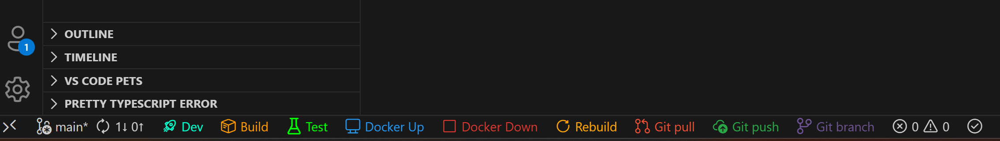

# Command Buttons

Add beautiful, customizable buttons to your VS Code status bar that run your most-used commands with a single click.

## Quick Start

Create a `.command-buttons.json` file at the root of your workspace:

```json
{
  "buttons": [
    {
      "icon": "rocket",
      "color": "#00ffcc",
      "text": "Dev",
      "command": "npm run dev"
    }
  ]
}
```

That's it! Your button will appear in the status bar, ready to launch your dev server.



## Configuration

### Required Fields

| Field     | Description         | Example                                  |
| --------- | ------------------- | ---------------------------------------- |
| `icon`    | Icon to display     | `"rocket"`                               |
| `color`   | Any valid CSS color | `"#00ffcc"`, `"green"`, `"rgb(255,0,0)"` |
| `command` | Command to execute  | `"npm run dev"`                          |

> 💡 Find available icons at [VS Code Codicons](https://microsoft.github.io/vscode-codicons/dist/codicon.html)

### Optional Fields

| Field          | Description                                                                              | Example        |
| -------------- | ---------------------------------------------------------------------------------------- | -------------- |
| `text`         | Text label next to icon (omit for icon-only buttons)                                     | `"Dev"`        |
| `directory`    | Working directory for command (relative to workspace root)                               | `"web"`        |
| `terminalName` | Terminal name for grouping commands (buttons with same name share a terminal)            | `"Web Server"` |
| `tab`          | Tab this button belongs to (see [Tabs](#tabs)). Untagged buttons are pinned to every tab | `"Dev"`        |

## Examples

### Basic Setup

Perfect for single-package projects:

```json
{
  "buttons": [
    {
      "icon": "rocket",
      "color": "#00ffcc",
      "text": "Dev",
      "command": "npm run dev"
    },
    {
      "icon": "package",
      "color": "rgba(255, 153, 0, 1)",
      "text": "Build",
      "command": "npm run build"
    },
    {
      "icon": "beaker",
      "color": "#00ff00",
      "text": "Test",
      "command": "npm test"
    }
  ]
}
```

### Grouped Terminals

Run related commands in the same terminal using `terminalName`:

```json
{
  "buttons": [
    {
      "icon": "rocket",
      "color": "#00ffcc",
      "text": "Dev",
      "command": "npm run dev",
      "terminalName": "Dev Server"
    },
    {
      "icon": "refresh",
      "color": "#00ffcc",
      "text": "Restart",
      "command": "npm run dev",
      "terminalName": "Dev Server"
    },
    {
      "icon": "beaker",
      "color": "#ff6b6b",
      "text": "Test",
      "command": "npm test",
      "terminalName": "Tests"
    },
    {
      "icon": "eye",
      "color": "#ff6b6b",
      "text": "Watch",
      "command": "npm run test:watch",
      "terminalName": "Tests"
    }
  ]
}
```

Dev and Restart share the "Dev Server" terminal, while Test and Watch share the "Tests" terminal.

## Tabs

When you have a lot of buttons, group them into **tabs** to keep the status bar tidy. Each tab name appears as its own clickable item in the status bar, click a tab to show its buttons and hide the others. Only the active tab's buttons are shown, plus any **pinned** (untagged) buttons that stay visible on every tab.

> If your config has no tabs at all, nothing changes, your buttons render exactly as before.

### Nested style (recommended)

Define a `tabs` array. The array order is the tab order, the first tab is active by default, and each tab can have an optional `icon` and `color`:

```json
{
  "tabs": [
    {
      "name": "Dev",
      "icon": "rocket",
      "buttons": [
        {
          "icon": "play",
          "color": "#4CAF50",
          "text": "Start",
          "command": "npm run dev"
        },
        {
          "icon": "beaker",
          "color": "#00ff00",
          "text": "Test",
          "command": "npm test"
        }
      ]
    },
    {
      "name": "Deploy",
      "icon": "cloud-upload",
      "buttons": [
        {
          "icon": "package",
          "color": "#FFA500",
          "text": "Build",
          "command": "npm run build"
        },
        {
          "icon": "rocket",
          "color": "#61DAFB",
          "text": "Ship",
          "command": "npm run deploy"
        }
      ]
    }
  ],
  "buttons": [
    {
      "icon": "gear",
      "color": "#888",
      "text": "Settings",
      "command": "code .vscode/settings.json"
    }
  ]
}
```

Here `Settings` has no tab, so it's **pinned**, visible on both the Dev and Deploy tabs.

### Flat style

Prefer a single `buttons` array? Just add a `tab` field to any button. Buttons sharing a `tab` value group together (in first-seen order); buttons without a `tab` are pinned:

```json
{
  "buttons": [
    {
      "icon": "play",
      "color": "#4CAF50",
      "text": "Start",
      "command": "npm run dev",
      "tab": "Dev"
    },
    {
      "icon": "beaker",
      "color": "#00ff00",
      "text": "Test",
      "command": "npm test",
      "tab": "Dev"
    },
    {
      "icon": "package",
      "color": "#FFA500",
      "text": "Build",
      "command": "npm run build",
      "tab": "Deploy"
    },
    {
      "icon": "gear",
      "color": "#888",
      "text": "Settings",
      "command": "code .vscode/settings.json"
    }
  ]
}
```

You can mix both styles, a top-level button with a `tab` matching a nested tab joins that tab.

> **Note:** With `statusBarAlignment` set to `"right"`, the visual order of tabs and buttons is mirrored.

### Monorepo Configuration

Target specific packages in your monorepo:

```json
{
  "buttons": [
    {
      "icon": "globe",
      "color": "#61DAFB",
      "text": "Web",
      "directory": "packages/web",
      "command": "npm run dev"
    },
    {
      "icon": "server",
      "color": "#68A063",
      "text": "API",
      "directory": "packages/api",
      "command": "npm run dev"
    },
    {
      "icon": "database",
      "color": "#336791",
      "text": "DB",
      "directory": "packages/database",
      "command": "npm run migrate"
    }
  ]
}
```

### Icon-Only Buttons

Save space in your status bar:

```json
{
  "buttons": [
    {
      "icon": "play",
      "color": "#4CAF50",
      "command": "npm start"
    },
    {
      "icon": "debug-stop",
      "color": "#f44336",
      "command": "npm run stop"
    },
    {
      "icon": "refresh",
      "color": "#2196F3",
      "command": "npm run restart"
    }
  ]
}
```

### Python Projects

```json
{
  "buttons": [
    {
      "icon": "play",
      "color": "#3776AB",
      "text": "Run",
      "command": "python main.py"
    },
    {
      "icon": "package",
      "color": "#FFD43B",
      "text": "Install",
      "command": "pip install -r requirements.txt"
    },
    {
      "icon": "beaker",
      "color": "#0A9396",
      "text": "Test",
      "command": "pytest"
    },
    {
      "icon": "check",
      "color": "#94D2BD",
      "text": "Lint",
      "command": "flake8 . && black --check ."
    }
  ]
}
```

### Docker Workflows

```json
{
  "buttons": [
    {
      "icon": "vm",
      "color": "#2496ED",
      "text": "Docker Up",
      "command": "docker-compose up -d"
    },
    {
      "icon": "debug-stop",
      "color": "#DC382D",
      "text": "Docker Down",
      "command": "docker-compose down"
    },
    {
      "icon": "refresh",
      "color": "#FFA500",
      "text": "Rebuild",
      "command": "docker-compose up -d --build"
    }
  ]
}
```

### Git Shortcuts

```json
{
  "buttons": [
    {
      "icon": "git-pull-request",
      "color": "#F05032",
      "command": "git pull"
    },
    {
      "icon": "cloud-upload",
      "color": "#28A745",
      "command": "git push"
    },
    {
      "icon": "git-branch",
      "color": "#6E5494",
      "command": "git status"
    }
  ]
}
```

### Database Operations

```json
{
  "buttons": [
    {
      "icon": "database",
      "color": "#4479A1",
      "text": "Migrate",
      "command": "npx prisma migrate dev"
    },
    {
      "icon": "symbol-field",
      "color": "#00758F",
      "text": "Seed",
      "command": "npx prisma db seed"
    },
    {
      "icon": "console",
      "color": "#E38C00",
      "text": "Studio",
      "command": "npx prisma studio"
    }
  ]
}
```

### Shell Scripts & Build Tools

```json
{
  "buttons": [
    {
      "icon": "terminal",
      "color": "#89B4FA",
      "text": "Setup",
      "command": "bash scripts/setup.sh"
    },
    {
      "icon": "wand",
      "color": "#B4BEFE",
      "text": "Generate",
      "command": "./scripts/codegen.sh"
    },
    {
      "icon": "tools",
      "color": "#F5C2E7",
      "text": "Make",
      "command": "make build"
    },
    {
      "icon": "symbol-namespace",
      "color": "#CBA6F7",
      "text": "Gradle",
      "command": "./gradlew build"
    }
  ]
}
```

### File Operations & Utilities

```json
{
  "buttons": [
    {
      "icon": "trash",
      "color": "#EE5A6F",
      "text": "Clean",
      "command": "rm -rf dist/ && rm -rf node_modules/.cache"
    },
    {
      "icon": "folder-opened",
      "color": "#F9E2AF",
      "text": "Open Logs",
      "command": "code logs/"
    },
    {
      "icon": "file-zip",
      "color": "#FAB387",
      "text": "Archive",
      "command": "tar -czf backup-$(date +%Y%m%d).tar.gz src/"
    }
  ]
}
```

## Features

- **Live Reload** - Buttons automatically update when you edit the config file
- **Terminal Integration** - Commands run in VS Code's integrated terminal or Ghostty
- **Ghostty Support** - Execute commands in the Ghostty terminal emulator (macOS)
- **Terminal Grouping** - Group related commands into separate terminals using `terminalName`
- **Tabs** - Organize buttons into clickable tabs, with pinned buttons shown on every tab
- **Flexible Styling** - Use any color format (hex, rgb, named colors)
- **Workspace Specific** - Different button configurations per project

## Extension Settings

This extension contributes the following settings:

### Terminal Settings

| Setting                              | Type      | Default                      | Description                                                                                                                      |
| ------------------------------------ | --------- | ---------------------------- | -------------------------------------------------------------------------------------------------------------------------------- |
| `commandButtons.defaultTerminalName` | `string`  | `"Command Buttons Terminal"` | The name of the terminal used for executing commands                                                                             |
| `commandButtons.terminalType`        | `string`  | `"vscode"`                   | The terminal to use for executing commands. Options: `"vscode"` (integrated terminal) or `"ghostty"` (Ghostty terminal emulator) |
| `commandButtons.reuseTerminal`       | `boolean` | `true`                       | Whether to reuse the same terminal for all commands or create a new one each time (only applies to VS Code integrated terminal)  |
| `commandButtons.focusTerminalOnRun`  | `boolean` | `true`                       | Whether to automatically focus the terminal when a command is executed (only applies to VS Code integrated terminal)             |

> **Note:** When using Ghostty, the following settings are not supported due to macOS limitations: `reuseTerminal`, `focusTerminalOnRun`, `showCommandRunningIndicator`, and the `terminalName` config field. Each command opens a new Ghostty window.

### Notification Settings

| Setting                                 | Type      | Default | Description                                               |
| --------------------------------------- | --------- | ------- | --------------------------------------------------------- |
| `commandButtons.showReloadNotification` | `boolean` | `true`  | Show a notification when the config file is reloaded      |
| `commandButtons.showErrorNotifications` | `boolean` | `true`  | Show notifications for validation errors and other issues |

### UI Settings

| Setting                                      | Type      | Default  | Description                                                           |
| -------------------------------------------- | --------- | -------- | --------------------------------------------------------------------- |
| `commandButtons.statusBarAlignment`          | `string`  | `"left"` | Position of buttons in the status bar. Options: `"left"` or `"right"` |
| `commandButtons.showButtonTooltips`          | `boolean` | `true`   | Show tooltips (command text) when hovering over buttons               |
| `commandButtons.iconOnlyMode`                | `boolean` | `false`  | Force all buttons to show only icons, hiding text labels              |
| `commandButtons.showCommandRunningIndicator` | `boolean` | `true`   | Show animated spinner icon on buttons while their command is running  |

### Configuration File Settings

| Setting                          | Type      | Default                   | Description                                               |
| -------------------------------- | --------- | ------------------------- | --------------------------------------------------------- |
| `commandButtons.configFileName`  | `string`  | `".command-buttons.json"` | Name of the configuration file in the workspace root      |
| `commandButtons.watchConfigFile` | `boolean` | `true`                    | Automatically reload buttons when the config file changes |

### Tab Settings

| Setting                             | Type      | Default       | Description                                                                                                                  |
| ----------------------------------- | --------- | ------------- | ---------------------------------------------------------------------------------------------------------------------------- |
| `commandButtons.rememberActiveTab`  | `boolean` | `true`        | Remember the last active tab per workspace and restore it on reload. When off, always start on the default tab               |
| `commandButtons.defaultActiveTab`   | `string`  | `""`          | Name of the tab to activate by default. Empty means the first tab in config order. Ignored if it doesn't match a tab         |
| `commandButtons.activeTabHighlight` | `string`  | `"prominent"` | How to highlight the active tab label. Options: `"prominent"`, `"warning"`, or `"none"` (VS Code supports a fixed color set) |

---

**Happy coding!** 🎉
